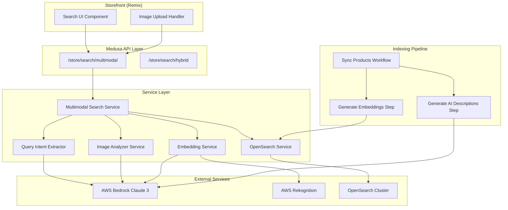
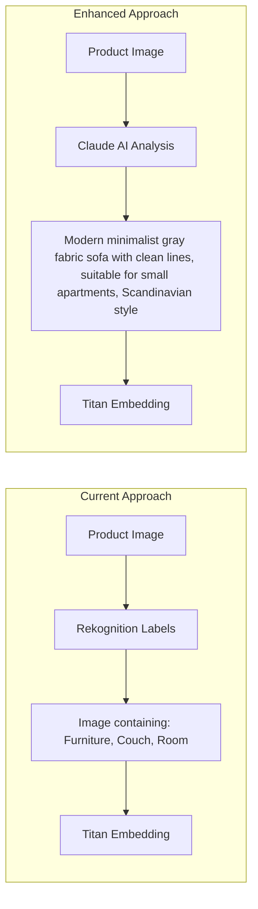
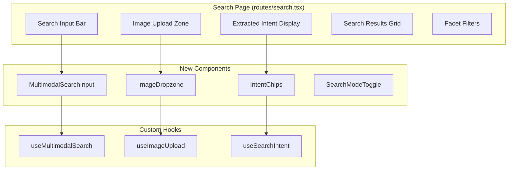
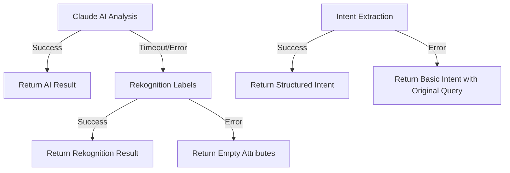

# Design Document: Multimodal Intelligent Search

## Overview

This design document describes the architecture and implementation of a Multimodal Intelligent Search system for an e-commerce platform. The system leverages Claude 3 Sonnet (via AWS Bedrock) to understand user intent from text, images, or combined inputs, delivering highly relevant search results.

The system extends the existing hybrid search infrastructure (keyword + semantic using OpenSearch) with three key innovations:
1. **AI-Powered Image Description**: Claude AI analyzes product images during indexing to generate rich, searchable descriptions
2. **Mixed-Modal Search**: Users can combine image uploads with text constraints (e.g., "like this but in blue")
3. **Query Intent Understanding**: Claude AI extracts structured search parameters from natural language queries

## Architecture



## Components and Interfaces

### 1. Image Analyzer Service

Responsible for generating rich textual descriptions from product images using Claude 3 Sonnet.

```typescript
interface ImageAnalyzerService {
  /**
   * Analyze a product image and generate bilingual descriptions
   * @param imageBuffer - Image data as Buffer
   * @returns Bilingual descriptions with extracted attributes
   */
  analyzeProductImage(imageBuffer: Buffer): Promise<ImageAnalysisResult>;
  
  /**
   * Analyze an uploaded search image to extract search-relevant features
   * @param imageBuffer - Uploaded image data
   * @returns Search-oriented description and attributes
   */
  analyzeSearchImage(imageBuffer: Buffer): Promise<SearchImageAnalysis>;
}

interface ImageAnalysisResult {
  description_en: string;      // English description
  description_zh: string;      // Chinese description
  attributes: ProductAttributes;
  confidence: number;
}

interface ProductAttributes {
  colors: string[];
  materials: string[];
  style: string;
  category: string;
  design_elements: string[];
}

interface SearchImageAnalysis {
  description: string;
  dominant_colors: string[];
  style_keywords: string[];
  suggested_category: string;
}
```

### 2. Query Intent Extractor Service

Extracts structured search parameters from natural language queries using Claude AI.

```typescript
interface QueryIntentExtractorService {
  /**
   * Extract structured intent from a natural language query
   * @param query - User's search query (Chinese or English)
   * @param imageContext - Optional context from uploaded image
   * @returns Structured search intent
   */
  extractIntent(query: string, imageContext?: SearchImageAnalysis): Promise<SearchIntent>;
}

interface SearchIntent {
  original_query: string;
  detected_language: 'en' | 'zh' | 'mixed';
  visual_reference?: string;
  constraints: SearchConstraints;
  search_type: 'text_only' | 'image_only' | 'mixed_modal';
}

interface SearchConstraints {
  colors?: string[];
  price_min?: number;
  price_max?: number;
  materials?: string[];
  categories?: string[];
  styles?: string[];
  size_constraints?: string;
  custom_filters?: Record<string, unknown>;
}
```

### 3. Multimodal Search Service

Orchestrates the multimodal search process, combining image analysis, intent extraction, and search execution.

```typescript
interface MultimodalSearchService {
  /**
   * Execute a multimodal search combining text and/or image inputs
   * @param request - Search request with optional text and image
   * @returns Search results with relevance metadata
   */
  search(request: MultimodalSearchRequest): Promise<MultimodalSearchResponse>;
}

interface MultimodalSearchRequest {
  query?: string;              // Optional text query
  image?: Buffer;              // Optional image data
  filters?: Record<string, unknown>;
  size?: number;
  regionId?: string;
}

interface MultimodalSearchResponse {
  results: SearchResult[];
  intent: SearchIntent;
  facets: Record<string, FacetResult>;
  meta: {
    total: number;
    responseTimeMs: number;
    searchType: 'text_only' | 'image_only' | 'mixed_modal';
  };
}
```

### 4. Enhanced OpenSearch Index Schema

Extended product document schema with AI-generated fields.

```typescript
interface EnhancedProductDocument {
  // Existing fields
  id: string;
  title: string;
  description: string;
  thumbnail: string;
  // ... other existing fields
  
  // New AI-generated fields
  ai_description_en: string;      // Claude-generated English description
  ai_description_zh: string;      // Claude-generated Chinese description
  ai_colors: string[];            // Extracted color attributes
  ai_materials: string[];         // Extracted material attributes
  ai_style: string;               // Style classification
  ai_design_elements: string[];   // Design element keywords
  ai_analysis_timestamp: string;  // When AI analysis was performed
  
  // Existing embedding fields
  text_embedding: number[];
  image_embedding: number[];
}
```

### 5. API Endpoint Interface

```typescript
// POST /store/search/multimodal
interface MultimodalSearchBody {
  query?: string;                 // Text query (optional if image provided)
  image?: string;                 // Base64 encoded image (optional if query provided)
  filters?: Record<string, unknown>;
  size?: number;
  regionId?: string;
  keywordWeight?: number;
  semanticWeight?: number;
}

interface MultimodalSearchAPIResponse {
  results: Array<{
    document: EnhancedProductDocument;
    score: number;
    matchType: 'text' | 'visual' | 'mixed' | 'semantic';
    similarityScore?: number;
    regionPrice?: number;
    regionCurrency?: string;
  }>;
  intent: SearchIntent;
  facets: Record<string, FacetResult>;
  meta: {
    query?: string;
    total: number;
    responseTimeMs: number;
    searchType: string;
    extractedConstraints: SearchConstraints;
  };
}
```

## Data Models

### Claude AI Prompt Templates

#### Product Image Analysis Prompt
```
Analyze this product image for an e-commerce search system.

Provide a detailed description in both English and Chinese that would help customers find this product through search.

Extract and return the following in JSON format:
{
  "description_en": "Detailed English description focusing on visual attributes, style, and use cases",
  "description_zh": "详细的中文描述，重点描述视觉属性、风格和使用场景",
  "attributes": {
    "colors": ["primary color", "secondary colors"],
    "materials": ["visible or likely materials"],
    "style": "style classification (modern, traditional, minimalist, etc.)",
    "category": "product category",
    "design_elements": ["notable design features"]
  }
}

Focus on attributes that customers would use when searching: colors, materials, style, size impression, and intended use.
```

#### Query Intent Extraction Prompt
```
Analyze this e-commerce search query and extract structured search parameters.

Query: "{user_query}"
{image_context if provided}

Return a JSON object with:
{
  "detected_language": "en" | "zh" | "mixed",
  "visual_reference": "description of visual style being sought (if any)",
  "constraints": {
    "colors": ["specific colors mentioned"],
    "price_min": number or null,
    "price_max": number or null,
    "materials": ["materials mentioned"],
    "categories": ["product categories"],
    "styles": ["style preferences"],
    "size_constraints": "any size requirements"
  },
  "search_keywords": ["key search terms extracted"]
}

Handle both Chinese and English queries. For Chinese price expressions like "1000以下", extract as price_max: 1000.
```

## Embedding Optimization Strategy

### Enhanced Embedding Generation

The current system uses Rekognition labels to generate image embeddings. This approach has limitations:
- Rekognition labels are generic (e.g., "Furniture", "Couch") and lack visual detail
- Labels don't capture style, color nuances, or design elements
- Semantic matching is limited by label vocabulary

**Optimization: AI-Enhanced Embeddings**

Instead of generating embeddings from Rekognition labels, we'll use Claude-generated descriptions:



### Embedding Field Strategy

```typescript
interface EnhancedEmbeddingFields {
  // Existing embeddings (keep for backward compatibility)
  text_embedding: number[];        // From title + description + categories
  image_embedding: number[];       // From Rekognition labels (legacy)
  
  // New AI-enhanced embeddings
  ai_text_embedding_en: number[];  // From Claude English description
  ai_text_embedding_zh: number[];  // From Claude Chinese description
  ai_combined_embedding: number[]; // From combined AI description + attributes
}
```

### Search Embedding Strategy

For different search types, use different embedding combinations:

| Search Type | Query Embedding Source | Document Embedding Target |
|-------------|----------------------|---------------------------|
| Text (English) | Query text → Titan | `ai_text_embedding_en` + `text_embedding` |
| Text (Chinese) | Query text → Titan | `ai_text_embedding_zh` + `text_embedding` |
| Image Only | Claude description → Titan | `ai_combined_embedding` + `image_embedding` |
| Mixed Modal | Combined description → Titan | `ai_combined_embedding` |

### Embedding Generation Workflow Enhancement

```typescript
// Enhanced embedding generation step
interface EnhancedEmbeddingInput {
  products: ProductDocument[];
  generateImageEmbeddings: boolean;
  generateAIEmbeddings: boolean;  // New flag for AI-enhanced embeddings
}

interface EnhancedEmbeddingOutput {
  products: EnhancedProductDocument[];
  textEmbeddingsGenerated: number;
  imageEmbeddingsGenerated: number;
  aiEmbeddingsGenerated: number;  // New counter
}
```

### Embedding Combination for Search

For multimodal search, combine embeddings with weighted scoring:

```typescript
interface EmbeddingSearchConfig {
  // Weight for different embedding types
  textEmbeddingWeight: number;      // Default: 0.3
  imageEmbeddingWeight: number;     // Default: 0.2
  aiEmbeddingWeight: number;        // Default: 0.5 (prioritize AI embeddings)
  
  // k-NN search parameters
  k: number;                        // Number of nearest neighbors
  minScore: number;                 // Minimum similarity threshold
}
```

### OpenSearch Index Mapping Updates

```typescript
// Additional k-NN vector fields for AI embeddings
const aiEmbeddingMappings = {
  ai_text_embedding_en: {
    type: 'knn_vector',
    dimension: 1024,
    method: {
      name: 'hnsw',
      space_type: 'cosinesimilarity',
      engine: 'faiss',
      parameters: { ef_construction: 128, m: 24 }
    }
  },
  ai_text_embedding_zh: {
    type: 'knn_vector',
    dimension: 1024,
    method: {
      name: 'hnsw',
      space_type: 'cosinesimilarity',
      engine: 'faiss',
      parameters: { ef_construction: 128, m: 24 }
    }
  },
  ai_combined_embedding: {
    type: 'knn_vector',
    dimension: 1024,
    method: {
      name: 'hnsw',
      space_type: 'cosinesimilarity',
      engine: 'faiss',
      parameters: { ef_construction: 128, m: 24 }
    }
  }
};
```

### Hybrid Search Enhancement

The enhanced hybrid search combines multiple signals:

```typescript
async function enhancedHybridSearch(
  queryText: string,
  queryEmbedding: number[],
  options: EnhancedSearchOptions
): Promise<SearchResult[]> {
  const { detectedLanguage, aiEmbeddingField } = options;
  
  // 1. Keyword search on title, description, AI descriptions
  const keywordResults = await keywordSearch(queryText, {
    fields: [
      'title^3',
      'description',
      detectedLanguage === 'zh' ? 'ai_description_zh^2' : 'ai_description_en^2',
      'ai_colors',
      'ai_materials'
    ]
  });
  
  // 2. Semantic search on AI-enhanced embeddings
  const semanticResults = await knnSearch(queryEmbedding, {
    field: aiEmbeddingField,  // ai_text_embedding_en or ai_text_embedding_zh
    k: options.size * 2
  });
  
  // 3. Merge with weighted scoring
  return mergeResults(keywordResults, semanticResults, options.weights);
}
```

### Performance Considerations

1. **Index Size**: Additional embedding fields increase index size by ~3x
   - Mitigation: Use compression, consider storing only primary language embedding

2. **Indexing Time**: Claude API calls add latency during indexing
   - Mitigation: Async processing, batch requests, caching

3. **Search Latency**: Multiple k-NN queries increase search time
   - Mitigation: Parallel queries, result caching, pre-filtering

### Migration Strategy

1. **Phase 1**: Add new fields to index mapping (backward compatible)
2. **Phase 2**: Generate AI embeddings for new products
3. **Phase 3**: Backfill AI embeddings for existing products
4. **Phase 4**: Enable AI-enhanced search (feature flag)
5. **Phase 5**: Deprecate legacy image embeddings

## Frontend Design (Storefront)

### Search UI Architecture



### New Components

#### 1. MultimodalSearchInput Component

Combined search input supporting text and image:

```typescript
// app/components/search/MultimodalSearchInput.tsx
interface MultimodalSearchInputProps {
  onSearch: (query: string, image?: File) => void;
  placeholder?: string;
  showImageUpload?: boolean;
  initialQuery?: string;
}

interface MultimodalSearchInputState {
  query: string;
  image: File | null;
  imagePreview: string | null;
  isUploading: boolean;
}
```

**Features:**
- Text input with autocomplete
- Drag-and-drop image upload zone
- Image preview with remove button
- Combined submit (text + image)
- Mobile-responsive design

#### 2. ImageDropzone Component

Dedicated image upload area:

```typescript
// app/components/search/ImageDropzone.tsx
interface ImageDropzoneProps {
  onImageSelect: (file: File) => void;
  onImageRemove: () => void;
  currentImage?: File | null;
  maxSizeMB?: number;
  acceptedFormats?: string[];
}
```

**Features:**
- Drag-and-drop support
- Click to browse
- Image preview
- File size validation
- Format validation (JPEG, PNG, WebP)
- Loading state during upload

#### 3. IntentChips Component

Display extracted search intent as interactive chips:

```typescript
// app/components/search/IntentChips.tsx
interface IntentChipsProps {
  intent: SearchIntent;
  onConstraintRemove: (constraintType: string, value: string) => void;
  onConstraintEdit: (constraintType: string) => void;
}
```

**Features:**
- Color chips (clickable to filter)
- Price range display
- Material/style tags
- Remove individual constraints
- Edit constraints inline

#### 4. SearchModeToggle Component

Toggle between search modes:

```typescript
// app/components/search/SearchModeToggle.tsx
interface SearchModeToggleProps {
  mode: 'text' | 'image' | 'mixed';
  onModeChange: (mode: 'text' | 'image' | 'mixed') => void;
}
```

### Custom Hooks

#### useMultimodalSearch Hook

Main hook for multimodal search functionality:

```typescript
// app/hooks/useMultimodalSearch.ts
interface UseMultimodalSearchOptions {
  backendUrl: string;
  regionId?: string;
  debounceMs?: number;
}

interface UseMultimodalSearchReturn {
  // State
  results: SearchResult[];
  intent: SearchIntent | null;
  facets: Record<string, FacetResult>;
  isLoading: boolean;
  error: Error | null;
  
  // Actions
  search: (query: string, image?: File) => Promise<void>;
  searchByImage: (image: File) => Promise<void>;
  searchByText: (query: string) => Promise<void>;
  clearResults: () => void;
  
  // Metadata
  searchType: 'text_only' | 'image_only' | 'mixed_modal' | null;
  responseTimeMs: number | null;
}

function useMultimodalSearch(options: UseMultimodalSearchOptions): UseMultimodalSearchReturn {
  // Implementation using fetch to /store/search/multimodal
}
```

#### useImageUpload Hook

Handle image upload and conversion:

```typescript
// app/hooks/useImageUpload.ts
interface UseImageUploadReturn {
  // State
  image: File | null;
  preview: string | null;
  isProcessing: boolean;
  error: string | null;
  
  // Actions
  selectImage: (file: File) => Promise<void>;
  removeImage: () => void;
  getBase64: () => Promise<string | null>;
  
  // Validation
  isValidFormat: boolean;
  isValidSize: boolean;
}
```

### Updated Search Page

```typescript
// app/routes/search.tsx
export default function SearchPage() {
  const { results, intent, facets, isLoading, search, searchType } = useMultimodalSearch({
    backendUrl: ENV.MEDUSA_BACKEND_URL,
    regionId: selectedRegion?.id,
  });
  
  const { image, preview, selectImage, removeImage, getBase64 } = useImageUpload();
  
  const handleSearch = async (query: string) => {
    const imageBase64 = image ? await getBase64() : undefined;
    await search(query, imageBase64);
  };
  
  return (
    <div className="search-page">
      {/* Search Mode Toggle */}
      <SearchModeToggle mode={searchMode} onModeChange={setSearchMode} />
      
      {/* Multimodal Search Input */}
      <MultimodalSearchInput
        onSearch={handleSearch}
        showImageUpload={searchMode !== 'text'}
        placeholder={getPlaceholder(searchMode)}
      />
      
      {/* Image Upload Zone (when in image/mixed mode) */}
      {searchMode !== 'text' && (
        <ImageDropzone
          onImageSelect={selectImage}
          onImageRemove={removeImage}
          currentImage={image}
        />
      )}
      
      {/* Extracted Intent Display */}
      {intent && (
        <IntentChips
          intent={intent}
          onConstraintRemove={handleConstraintRemove}
        />
      )}
      
      {/* Search Results */}
      <SearchResults
        results={results}
        isLoading={isLoading}
        searchType={searchType}
      />
      
      {/* Facet Filters */}
      <FacetFilters facets={facets} onFilterChange={handleFilterChange} />
    </div>
  );
}
```

### UI/UX Design Specifications

#### Search Input States

```
┌─────────────────────────────────────────────────────────────┐
│  🔍  Search for products...                    [📷] [🔍]   │
├─────────────────────────────────────────────────────────────┤
│                                                             │
│  ┌─────────────────────────────────────────────────────┐   │
│  │                                                     │   │
│  │     📷 Drop an image here or click to upload       │   │
│  │                                                     │   │
│  │     Supported: JPEG, PNG, WebP (max 5MB)          │   │
│  │                                                     │   │
│  └─────────────────────────────────────────────────────┘   │
│                                                             │
└─────────────────────────────────────────────────────────────┘
```

#### With Image Uploaded

```
┌─────────────────────────────────────────────────────────────┐
│  🔍  like this but in blue color               [📷] [🔍]   │
├─────────────────────────────────────────────────────────────┤
│                                                             │
│  ┌──────────┐                                              │
│  │  [IMG]   │  ✕ Remove                                    │
│  │  preview │                                              │
│  └──────────┘                                              │
│                                                             │
│  Extracted Intent:                                          │
│  ┌────────┐ ┌──────────────┐ ┌─────────────┐              │
│  │ 🎨 Blue│ │ 🖼️ Similar to │ │ ✕ Clear all │              │
│  └────────┘ └──────────────┘ └─────────────┘              │
│                                                             │
└─────────────────────────────────────────────────────────────┘
```

#### Search Results with Match Type Indicators

```
┌─────────────────────────────────────────────────────────────┐
│  Found 24 products • Mixed modal search • 1.2s             │
├─────────────────────────────────────────────────────────────┤
│                                                             │
│  ┌─────────┐  ┌─────────┐  ┌─────────┐  ┌─────────┐       │
│  │ [IMG]   │  │ [IMG]   │  │ [IMG]   │  │ [IMG]   │       │
│  │         │  │         │  │         │  │         │       │
│  │ Product │  │ Product │  │ Product │  │ Product │       │
│  │ $299    │  │ $199    │  │ $399    │  │ $249    │       │
│  │ 🎯 95%  │  │ 🎯 92%  │  │ 🎯 88%  │  │ 🎯 85%  │       │
│  │ [mixed] │  │ [visual]│  │ [text]  │  │ [mixed] │       │
│  └─────────┘  └─────────┘  └─────────┘  └─────────┘       │
│                                                             │
└─────────────────────────────────────────────────────────────┘
```

### Responsive Design

**Mobile Layout:**
- Stacked search input and image upload
- Collapsible intent chips
- Single column results grid
- Bottom sheet for facet filters

**Tablet Layout:**
- Side-by-side search input and image preview
- Horizontal scrolling intent chips
- 2-column results grid
- Sidebar facet filters

**Desktop Layout:**
- Full-width search bar with inline image upload
- Inline intent chips
- 3-4 column results grid
- Sidebar facet filters

### Accessibility Requirements

1. **Keyboard Navigation**
   - Tab through search input, image upload, results
   - Enter to submit search
   - Escape to clear image

2. **Screen Reader Support**
   - ARIA labels for all interactive elements
   - Announce search results count
   - Describe uploaded image

3. **Visual Accessibility**
   - High contrast mode support
   - Focus indicators
   - Error state announcements

### Internationalization

Support for bilingual UI:

```typescript
// libs/i18n/search.ts
const searchTranslations = {
  en: {
    placeholder: 'Search for products...',
    uploadImage: 'Drop an image here or click to upload',
    extractedIntent: 'Extracted Intent',
    clearAll: 'Clear all',
    matchType: {
      text: 'Text match',
      visual: 'Visual match',
      mixed: 'Mixed match',
      semantic: 'Semantic match',
    },
  },
  zh: {
    placeholder: '搜索产品...',
    uploadImage: '拖放图片或点击上传',
    extractedIntent: '识别的搜索意图',
    clearAll: '清除全部',
    matchType: {
      text: '文字匹配',
      visual: '视觉匹配',
      mixed: '混合匹配',
      semantic: '语义匹配',
    },
  },
};
```

### Frontend API Integration

#### Multimodal Search Connector Update

```typescript
// libs/util/search/multimodalSearchConnector.ts
export interface MultimodalSearchConnectorConfig extends HybridSearchConnectorConfig {
  enableImageSearch?: boolean;
  enableIntentExtraction?: boolean;
  maxImageSizeMB?: number;
}

export function createMultimodalSearchConnector(
  config: MultimodalSearchConnectorConfig
): APIConnector {
  return {
    async onSearch(state: RequestState, queryConfig: QueryConfig): Promise<ResponseState> {
      const { searchTerm, imageData } = state;
      
      // Determine endpoint based on input
      const endpoint = imageData 
        ? `${config.backendUrl}/store/search/multimodal`
        : `${config.backendUrl}/store/search/hybrid`;
      
      const response = await fetch(endpoint, {
        method: 'POST',
        headers: { 'Content-Type': 'application/json' },
        body: JSON.stringify({
          query: searchTerm,
          image: imageData,
          size: queryConfig.resultsPerPage,
          regionId: config.regionId,
        }),
      });
      
      const data = await response.json();
      
      return {
        results: transformResults(data.results),
        totalResults: data.meta.total,
        facets: transformFacets(data.facets),
        intent: data.intent,  // New: include extracted intent
        rawResponse: data,
      };
    },
    // ... other methods
  };
}
```

## Correctness Properties

*A property is a characteristic or behavior that should hold true across all valid executions of a system—essentially, a formal statement about what the system should do. Properties serve as the bridge between human-readable specifications and machine-verifiable correctness guarantees.*


Based on the prework analysis, the following properties have been identified:

### Property 1: Bilingual Description Generation
*For any* valid product image analyzed by the Image_Analyzer, the result SHALL contain both `description_en` and `description_zh` fields as non-empty strings.
**Validates: Requirements 1.2, 7.3**

### Property 2: Attribute Extraction Completeness
*For any* successful image analysis result, the `attributes` object SHALL contain all required fields: `colors` (array), `materials` (array), `style` (string), `category` (string), and `design_elements` (array).
**Validates: Requirements 1.3**

### Property 3: AI Description Persistence Round-Trip
*For any* product that has been indexed with AI analysis, querying the OpenSearch index for that product SHALL return the AI-generated description fields (`ai_description_en`, `ai_description_zh`, `ai_colors`, `ai_materials`, `ai_style`).
**Validates: Requirements 1.4**

### Property 4: Graceful Fallback on Service Failure
*For any* image analysis or intent extraction operation that fails due to external service unavailability, the system SHALL not throw an unhandled exception and SHALL return a valid fallback result (Rekognition labels for images, original query for intent).
**Validates: Requirements 1.5, 8.2, 8.3**

### Property 5: Mixed-Modal Constraint Filtering
*For any* mixed-modal search with extracted constraints (color, price, material, category), all returned results SHALL satisfy those constraints.
**Validates: Requirements 2.4, 2.5**

### Property 6: Constraint Type Support
*For any* of the supported constraint types (color, price_min, price_max, material, category, style), when that constraint is present in a query, the Query_Intent_Extractor SHALL correctly identify and extract it into the SearchConstraints object.
**Validates: Requirements 2.6**

### Property 7: Intent Extraction Structure
*For any* natural language query processed by the Query_Intent_Extractor, the result SHALL be a valid SearchIntent object containing: `original_query`, `detected_language`, `constraints`, and `search_type` fields.
**Validates: Requirements 3.1, 3.5**

### Property 8: Bilingual Query Parsing
*For any* query containing price constraints in Chinese format (e.g., "1000以下", "500元以上") or English format (e.g., "under $100", "above 50"), the Query_Intent_Extractor SHALL correctly extract the numeric value and constraint type (min/max).
**Validates: Requirements 3.3, 3.4, 7.1, 7.2**

### Property 9: Graceful Degradation on Intent Failure
*For any* query where intent extraction fails, the system SHALL fall back to standard hybrid search using the original query text and SHALL return valid search results.
**Validates: Requirements 3.7**

### Property 10: Image-Only Search Analysis
*For any* search request containing only an image (no text query), the system SHALL analyze the image using Claude AI and SHALL return a SearchImageAnalysis object with `description`, `dominant_colors`, and `style_keywords` fields.
**Validates: Requirements 5.1, 5.2**

### Property 11: API Input Validation
*For any* multimodal search API request, if at least one of `query` or `image` is provided, the API SHALL return a 200 response with results; if neither is provided, the API SHALL return a 400 error.
**Validates: Requirements 6.2, 6.3, 6.4**

### Property 12: API Response Completeness
*For any* successful multimodal search API response, the response SHALL contain: `results` (array with document, score, matchType), `intent` (SearchIntent object), `facets` (object), and `meta` (object with total, responseTimeMs, searchType).
**Validates: Requirements 6.5**

### Property 13: Language-Appropriate Matching
*For any* search query, when the detected language is Chinese, the search SHALL match against `ai_description_zh`; when English, against `ai_description_en`.
**Validates: Requirements 7.4**

### Property 14: Retry with Exponential Backoff
*For any* transient AWS Bedrock failure, the system SHALL retry the operation with exponential backoff delays (base delay * 2^attempt) up to a maximum number of retries before falling back.
**Validates: Requirements 8.4**

## Error Handling

### Error Categories and Handling Strategies

| Error Type | Source | Handling Strategy |
|------------|--------|-------------------|
| Image Analysis Timeout | AWS Bedrock | Use Rekognition labels as fallback, log warning |
| Intent Extraction Failure | AWS Bedrock | Fall back to standard hybrid search |
| Invalid Image Format | User Upload | Return 400 with descriptive error message |
| OpenSearch Unavailable | OpenSearch | Return 503 with retry-after header |
| Rate Limit Exceeded | AWS Bedrock | Implement exponential backoff, queue requests |

### Error Response Format

```typescript
interface ErrorResponse {
  error: string;
  message: string;
  code: string;
  fallback_used?: boolean;
  original_error?: string;
}
```

### Fallback Chain



## Testing Strategy

### Unit Tests

Unit tests focus on individual component behavior:

1. **Image Analyzer Service**
   - Test prompt construction for various image types
   - Test response parsing from Claude API
   - Test attribute extraction from JSON responses
   - Test error handling for malformed responses

2. **Query Intent Extractor**
   - Test Chinese price pattern extraction ("1000以下" → price_max: 1000)
   - Test English price pattern extraction ("under $100" → price_max: 100)
   - Test color extraction from various phrasings
   - Test language detection accuracy

3. **Multimodal Search Service**
   - Test search type determination (text_only, image_only, mixed_modal)
   - Test constraint application to search queries
   - Test result merging and scoring

### Property-Based Tests

Property-based tests verify universal properties across many generated inputs. Each test should run a minimum of 100 iterations.

**Testing Framework**: Jest with `fast-check` for property-based testing

**Test Configuration**:
```typescript
import fc from 'fast-check';

// Configure minimum iterations
fc.configureGlobal({ numRuns: 100 });
```

**Property Test Implementation Pattern**:
```typescript
// Feature: multimodal-intelligent-search, Property 7: Intent Extraction Structure
describe('Query Intent Extractor', () => {
  it('should return valid SearchIntent for any query', () => {
    fc.assert(
      fc.property(fc.string({ minLength: 1, maxLength: 500 }), async (query) => {
        const result = await intentExtractor.extractIntent(query);
        
        expect(result).toHaveProperty('original_query');
        expect(result).toHaveProperty('detected_language');
        expect(result).toHaveProperty('constraints');
        expect(result).toHaveProperty('search_type');
        expect(['en', 'zh', 'mixed']).toContain(result.detected_language);
      })
    );
  });
});
```

### Integration Tests

1. **End-to-End Search Flow**
   - Test complete multimodal search with text + image
   - Test image-only search flow
   - Test text-only search with intent extraction

2. **Indexing Pipeline**
   - Test product indexing with AI description generation
   - Test fallback behavior when Claude is unavailable

3. **API Contract Tests**
   - Test backward compatibility with existing hybrid search
   - Test new multimodal endpoint responses

### Test Data Generators

```typescript
// Arbitrary for SearchConstraints
const searchConstraintsArb = fc.record({
  colors: fc.option(fc.array(fc.constantFrom('red', 'blue', 'green', 'black', 'white'))),
  price_min: fc.option(fc.integer({ min: 0, max: 10000 })),
  price_max: fc.option(fc.integer({ min: 0, max: 10000 })),
  materials: fc.option(fc.array(fc.constantFrom('leather', 'fabric', 'wood', 'metal'))),
  categories: fc.option(fc.array(fc.string())),
});

// Arbitrary for Chinese price queries
const chinesePriceQueryArb = fc.tuple(
  fc.integer({ min: 100, max: 100000 }),
  fc.constantFrom('以下', '以上', '左右', '元以内')
).map(([price, suffix]) => `${price}${suffix}`);

// Arbitrary for English price queries
const englishPriceQueryArb = fc.tuple(
  fc.constantFrom('under', 'below', 'above', 'over', 'around'),
  fc.integer({ min: 10, max: 10000 })
).map(([prefix, price]) => `${prefix} $${price}`);
```
